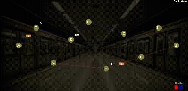

# MetroSimulator 

 This _university_ project was made for a C++ class. 
It simulates a metro network where trains transport passengers dynamically. The interface with the program is done using [Simple Graphics Library]((https://github.com/cgaueb/sgg))

## How it works
When the program starts, 10 stations spawn _pseudo-randomly_ around the map. There are 3 possible combinations of station placement, with 70% probability 
for the most common one, 20% for the second, and 10% for the least common. 
The user has to create two routes, one blue and one red, using up to 4 blue and 5 red rails,
that can only be placed continuously for each color/route. The Simulation starts after pressing Enter(Return). By starting, passengers will spawn every 5s, declaring
a destination. 
The shortest path from their starting station to their final destination is calculated dynamically using a **Breadth-First Search** algorithm. 
If the network is too slow or inefficient and more than 5 people are waiting in a single station, the simulation **ends**

## Controls
* **Left Mouse Button:** Connect two stations to build a rail.
* **Left Mouse Click:** Select rail color (click on the red or blue box at the down right).
* **Enter:** Start the simulation.
* **Spacebar:** Pause / Resume the simulation.

## Build and Run
This project was developed using Visual Studio on Windows.
1. Clone this repository: `git clone https://github.com/GeorgeGiandev/MetroSimulator.git`
2. Open the `MetroSimulator.sln` file using **Visual Studio**.
3. Ensure the build configuration is set to `x64`.
4. Build and Run the project.

## SGG LIBRARY
The program's graphical interface is made up entirely of the SGG library. For information about how to install and use the library, visit 
this [page]((https://cgaueb.github.io/sgg/pages.html))
